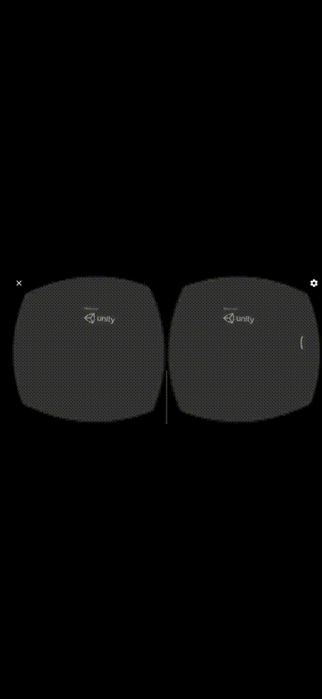

## Gif de ejecución

## Implementación:

Se ha implementado la SDK de Google Cardboard para la compatibilidad de VR con móviles Android.

Para ello hubo que cambiar algunos parámetros de la cámara para hacerla compatible con el sistema VR, hacer alguna utilidad para enlazarla al tank del jugador y por último usar los prefabs del SDK para tener utilidades como el tracking según el giroscopio del teléfono y el punto de retina.

Esta configuración puede dar lugar al famoso "motion sickness" según el usuario que lo esté jugando. Para evitar esto habría que implementar una soluciçon más compleja de cámara, que suavice las rotaciones y las transiciones entre rondas.

Tras hacer una pequeña prueba en un dispositivo android y usando unas gafas genéricas, se puede comprobar que tras 5 minutos de prueba puede resultar molesto, por lo que es necesaria la mejora anteriormente nombrada.